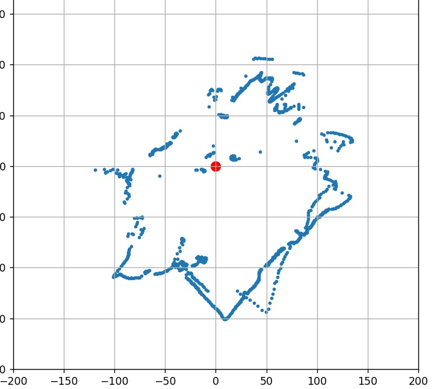
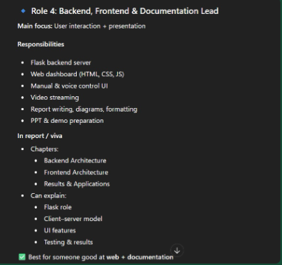

# Swarm Robotics System — WhatsApp Chat Export

Saved from your WhatsApp self-chat ("Message yourself") on **9 Sept 2026**.

## Project description

**Swarm Robotics System using OpenCV and Aruco Markers**

Our swarm robotics system consists of multiple robots that can be controlled in
manual, voice, and autonomous modes. Each robot is equipped with:

- 60 RPM BO motors for smooth movement
- ESP32 microcontroller for seamless communication and control
- OpenCV-powered vision system for Aruco marker detection and tracking
- TF Luna LiDAR for mapping and obstacle avoidance

**Control Modes**
- **Manual Mode** — robots controlled remotely via a graphical interface or keyboard inputs
- **Voice Mode** — robots respond to voice commands, hands-free control
- **Autonomous Mode** — robots navigate and make decisions independently using LiDAR mapping and computer vision

**Aruco Marker-based Control** — Aruco markers are used for robot localization and identification. The OpenCV vision system detects and tracks these markers, enabling:
- Robot positioning and orientation tracking
- Inter-robot communication and coordination
- Precise control and navigation

**Key Features**
- Multi-mode control for flexibility and adaptability
- LiDAR-based mapping and obstacle avoidance
- Aruco marker-based localization and tracking
- ESP32 and Python-based architecture for easy customization and extension

**Potential applications**: search and rescue operations, environmental monitoring, industrial automation, education and research.

## Team roles (from chat)

### Role 1: Hardware & Mechanical Lead
Main focus: Physical robot
- Chassis design & assembly
- Motor selection, wheels, mounting
- Battery, buck converter, power wiring
- Sensor mounting (LiDAR, servo, camera)
- Debugging hardware issues

In report/viva — Chapter: Hardware Architecture. Can confidently explain: Why ESP32? Why L298N? Power calculations, Motor RPM selection. Best for someone good with hands-on electronics.

### Role 2: Embedded/Firmware Developer
Main focus: ESP32 code inside robots
- ESP32 firmware (Arduino / C++)
- Motor control logic (PWM, directions)
- WiFi connection + UDP communication
- Follower logic (leader → white → red)
- Safety logic (stop, slow, timeout)

In report/viva — Chapter: Firmware Architecture. Can explain: Why UDP over TCP, Control loop (50 Hz), Pin configurations, State machine (AUTO / MANUAL). Best for someone strong in Arduino / ESP32.

### Role 3: Computer Vision & Control Algorithms Lead
Main focus: Brain of the system
- OpenCV + ArUco detection
- Pose estimation (x, y, angle)
- Navigation logic (angle, distance)
- Formation control algorithm
- Collision & stop-distance logic

In report/viva — Chapters: Vision Processing, Control Algorithms. Can explain: ArUco markers, Angle-to-target math, Leader–Follower logic, Why not GPS/SLAM. Best for someone interested in AI / CV / math.

### Role 4: Backend, Frontend & Documentation Lead
Main focus: User interaction + presentation
- Flask backend server
- Web dashboard (HTML, CSS, JS)
- Manual & voice control UI
- Video streaming
- Report writing, diagrams, formatting
- PPT & demo preparation

In report/viva — Chapters: Backend Architecture, Frontend Architecture, Results & Applications. Can explain: Flask role, Client–server model, UI features, Testing & results. Best for someone good at web + documentation.

## Firmware code

Two ESP32 sketches were shared, saved under `code/`:
- `leader_bot_esp32.ino` — leader robot (pins ENA=19, IN1=2, IN2=4, IN3=18, IN4=5, ENB=15)
- `red_bot_esp32.ino` — follower "red bot" (pins ENA=15, ENB=25, IN1=2, IN2=4, IN3=27, IN4=26)

Both listen for UDP text commands (`forward`, `backward`, `left`, `right`, `stop`) on port 3333 and drive an L298N-style dual H-bridge motor driver.

## Test result

Message: *"its working — lidar mapping is working"*, with a LiDAR point-cloud mapping plot attached below.

## Team roles (screenshot)

## Media

- `images/` — role-description screenshot and the LiDAR mapping plot
- Note: 6 robot demo videos were also forwarded in the original chat but are not included here — grab them directly from the phone if needed.
